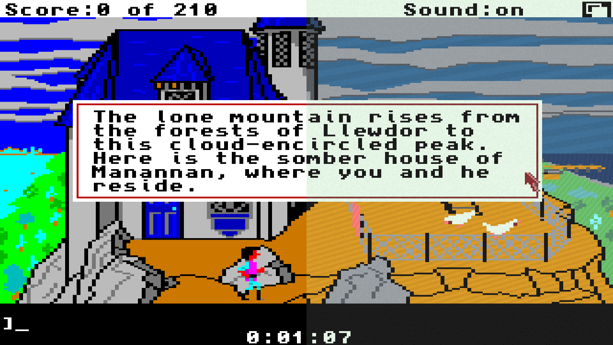

AACC
====

Set of StreamFX Shaders to be used with OBS and certain older Amiga games that are patched to allow palette swaps through lookup tables, as well as add some predictive noise and diagonal line patterns per colour.

The method involves altering the palette table within the game executable. Typically Amiga ECS/OCS games are encoded as
12-bit RGB colour files, such as:

- 0B0B for Magenta.

This method replaces the palette table with known values that can be later looked up using a shader, when looking at the Amiga video directly with the new method, the picture is presented as different shades of yellow, but the colour is encoded to tell the shader what colour index it is, rather than the colour information, i.e. if the 4th colour is always blue, then that palette entry would be.

- 0AC4 for Colour Index 4.

When the Shader is run over the image, instead of doing expensive distance functions against all known colours, the B component is taken and treated as the Colour Index value.

However, this method has several flaws - such as different palettes, palette cycling, etc. so are only suited to certain Amiga games such as the earlier Sierra Adventure games which used a fixed number of colours.

Police Quest 1
--------------

Palette is replaced with the [EGA COM Extended](https://lospec.com/palette-list/ega-com-extended) Palette. Additional options are to add per colour diagonal lines and/or noise on top.

Instructions:

1. In your Video Source or Window Capture, add the the Shader Effect as a Filter. Select the `PoliceQuest1/PoliceQuest1.effect` file as the Shader source. Ensure that the Video source size is a ratio of 320x200 (640x400 or 960x600 for better results).

    Techniques:

        1. AACC_PoliceQuest1                - Replace Palette with EGA COM
        2. AACC_PoliceQuest1_Original       - Restore with the Original Palette
        3. AACC_PoliceQuest1_Pattern        - Replace palette and add per colour diagonal patterns
        4. AACC_PoliceQuest1_Noise          - Replace palette and add per colour noise
        5. AACC_PoliceQuest1_Noise_Pattern  - Replace palette and add per colour noise and diagonal patterns

    Shader Parameters:

        1. Noise Modifier - Amount of Noise Added
        2. Pattern Scale  - Size of Diagonal Lines
        3. Tint Modifier  - Noise and Diagonal Colour Tint.  <255 Darker or >255 Brighter.
        
2. Patch the PoliceQuest1 files (Palette Changes Only):

~~~
    robin@Ubuntu:/home/robin$ patch -p0 < PoliceQuest1.patch
    patching file PoliceQuest/Data/Busy
    patching file PoliceQuest/Data/Pointer
    patching file PoliceQuest/PQ
~~~

Palette may be changed through changing lines 64 to 84 in the effect file. Noise and Pattern sizes may be adjusted by changing the tables at lines 155-172 and 176-192.

Kings Quest 3 (Kixx Release)
----------------------------

Palette is replaced with the [EGA COM Extended](https://lospec.com/palette-list/ega-com-extended) Palette. Additional options are to add per colour diagonal lines and/or noise on top. This is an identical process to Police Quest 1.

Instructions:

1. In your Video Source or Window Capture, add the the Shader Effect as a Filter. Select the `KingsQuest3Kixx/KingsQuest3Kixx.effect` file as the Shader source. Ensure that the Video source size is a ratio of 320x200 (640x400 or 960x600 for better results).

    Techniques:

        1. AACC_KingsQuest3                - Replace Palette with EGA COM
        2. AACC_KingsQuest3_Original       - Restore with the Original Palette
        3. AACC_KingsQuest3_Pattern        - Replace palette and add per colour diagonal patterns
        4. AACC_KingsQuest3_Noise          - Replace palette and add per colour noise
        5. AACC_KingsQuest3_Noise_Pattern  - Replace palette and add per colour noise and diagonal patterns

    Shader Parameters:

        1. Noise Modifier - Amount of Noise Added
        2. Pattern Scale  - Size of Diagonal Lines
        3. Tint Modifier  - Noise and Diagonal Colour Tint.  <255 Darker or >255 Brighter.
        
2. Patch the Kings Quest 3 files (Palette Changes Only):

~~~
    robin@Ubuntu:/home/robin$ patch -p0 < KingsQuest3Kixx.patch
    patching file KQ3/Data/Pointer
    patching file KQ3/KQ3
~~~

Palette may be changed through changing lines 64 to 84 in the effect file. Noise and Pattern sizes may be adjusted by changing the tables at lines 155-172 and 176-192.
